# ARD*SEQU*INO Guide

## Assembly Instructions

### Circuit

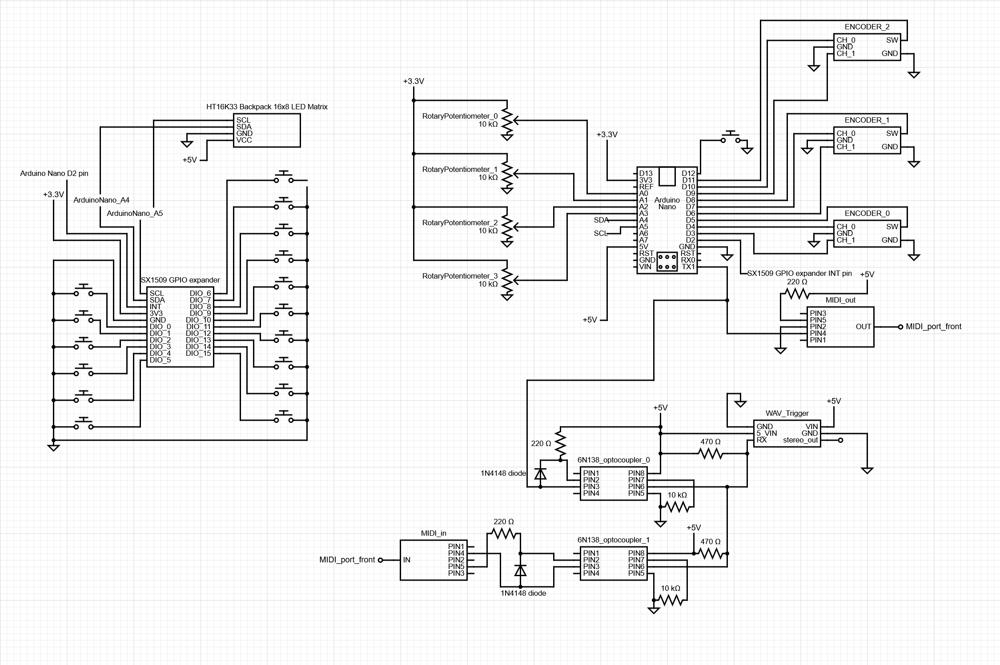
*A schematic of the **ARD**SEQU**INO** circuit.*

I wish I could provide a step-by-step breakdown of how I wired the circuit together, but, the process required multiple iterations of trial-and-error that I simply did not take the time to document. For a closer look at the circuit schematic, a file titled `circuit.cddx`, located in the `/assets` directory can be opened in [this web-based program](https://www.circuit-diagram.org/).

One note, if you plan to assemble the **ARD***SEQU***INO** with the enclosure, you will want to mount the key switches to the **Lower face panel** (as shown in the next section) before proceeding with any soldering involving the key switches.

### Enclosure

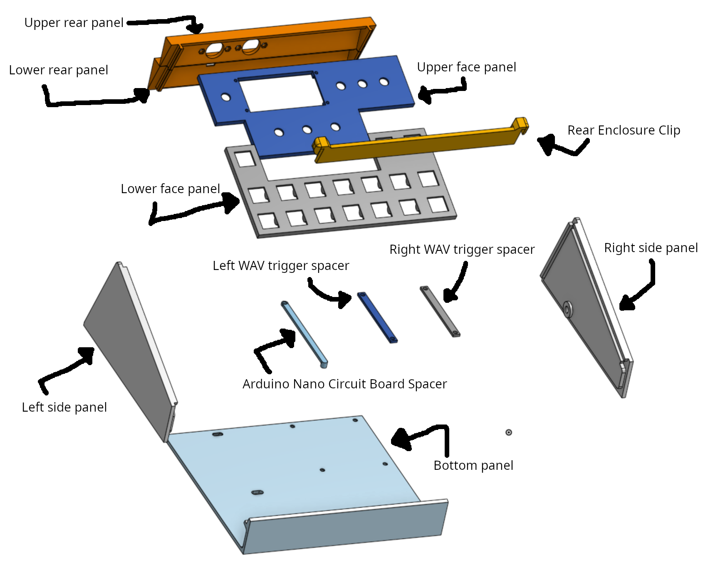
*Labels for each part of the enclosure*

*A gif demonstrating the assembly process of the enclosure*

Please read through these instructions completely before beginning assembly! And if you have any questions, refer to the images below for context.

0. take the **Upper face panel** and run it along the grooves at the top-end of both side panels to wear down the grooves a bit. This will make it easier to insert the face panel in a future step.

1. Attach the **Left side panel** and **Right side panel** to the **Bottom Panel**. Affix with your preferred bonding material (I used CA glue).
   - step 1.5.1 - optionally, use the the 5 M3 screws to hold the spacers in place at this step, but you can do this later as well.
2. Mount the key switches (pre-soldering for this part in particular), encoders, potentiometers, and LED panel to the **Upper face panel** and **Lower face panel**.
3. Mount both MIDI 5-pin sockets into the two holes of the **Upper rear panel** (pre-soldering).
4. Wire everything together and test that it all works as designed (I highly recommend not soldering wires directly to the board but instead use a breadboard or protoboard with jumper wire headers).
5. Slide the Face panels (along with the circuit) in-between the side panels along the groove.
6. Mount the Arduino Nano circuit board to the **Arduino Nano Circuit Board Spacer** and the WAV trigger to both the **Left WAV trigger spacer** and **Right WAV trigger spacer**. Screw them all down using the M3 nuts.
7. (If not already connected) wire the MIDI 5-pin sockets to your Arduino Nano circuit board.
8. Bond the **Upper face panel** and the **Lower face panel** along the seam they meet at. Only proceed with this step once you've made sure everything else works as intended. The circuits will be much harder to examine/change/fix once the face panel is bonded together.
9. Snap the **Lower rear panel** in. This step will require a firm push.
10. Snap the **Upper rear panel** in place.
11. Slide the **Rear enclosure clip** down to finish the assembly!

### Pictures from the assembly process

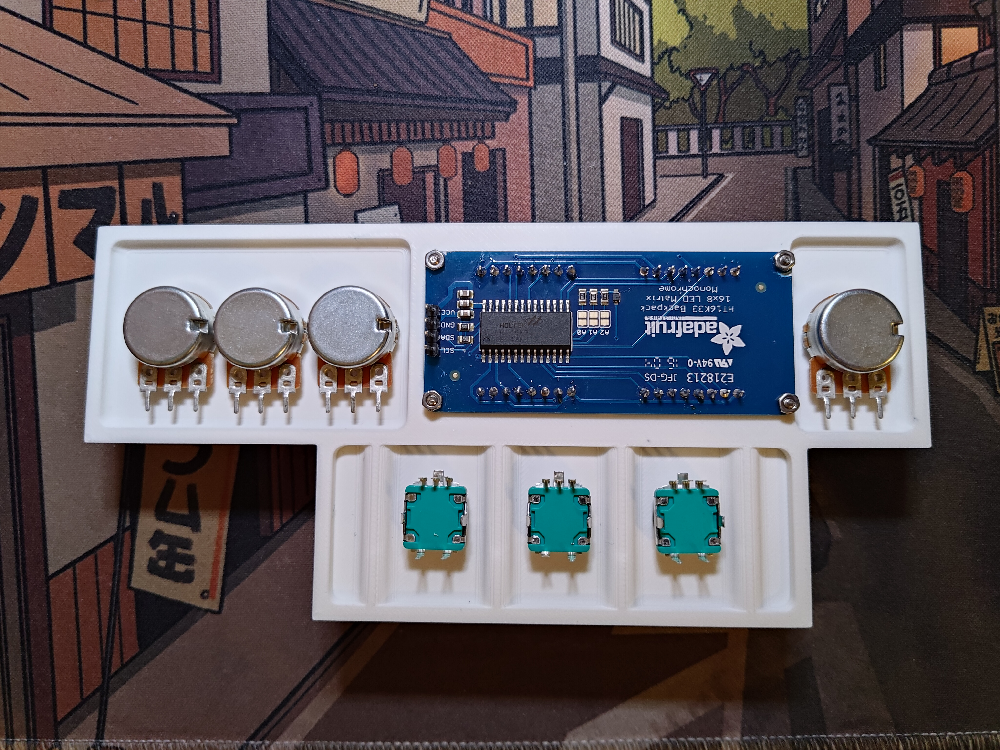
*The **Upper face panel** with the encoders, potentiometers, and LED panel (mounted using the M2 screws and nuts) installed.*

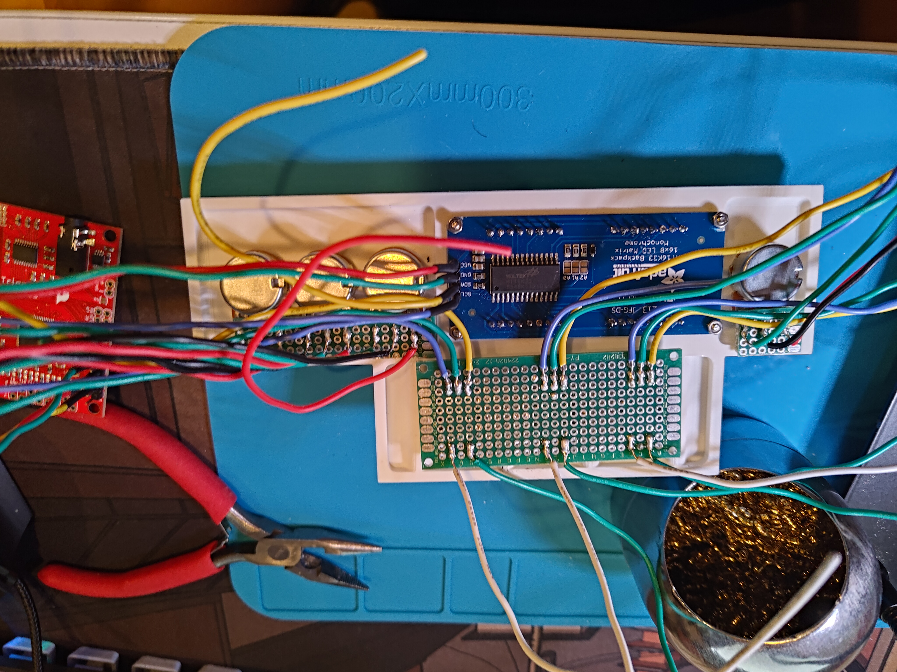
*The wiring for all the encoders, potentiometers, and LED panel (partially complete).*

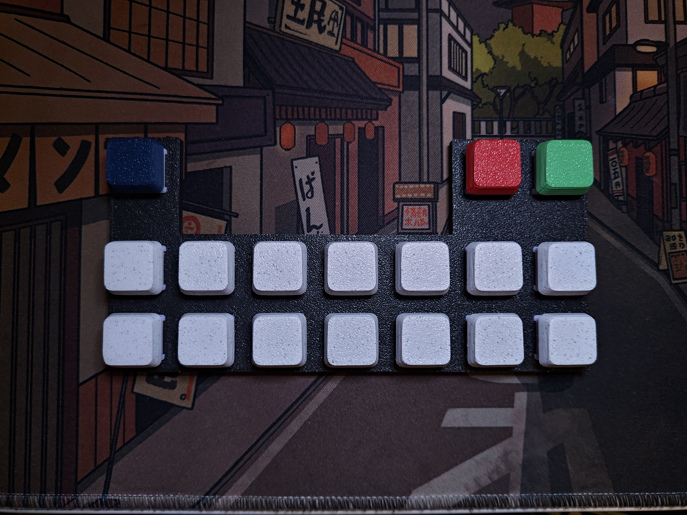
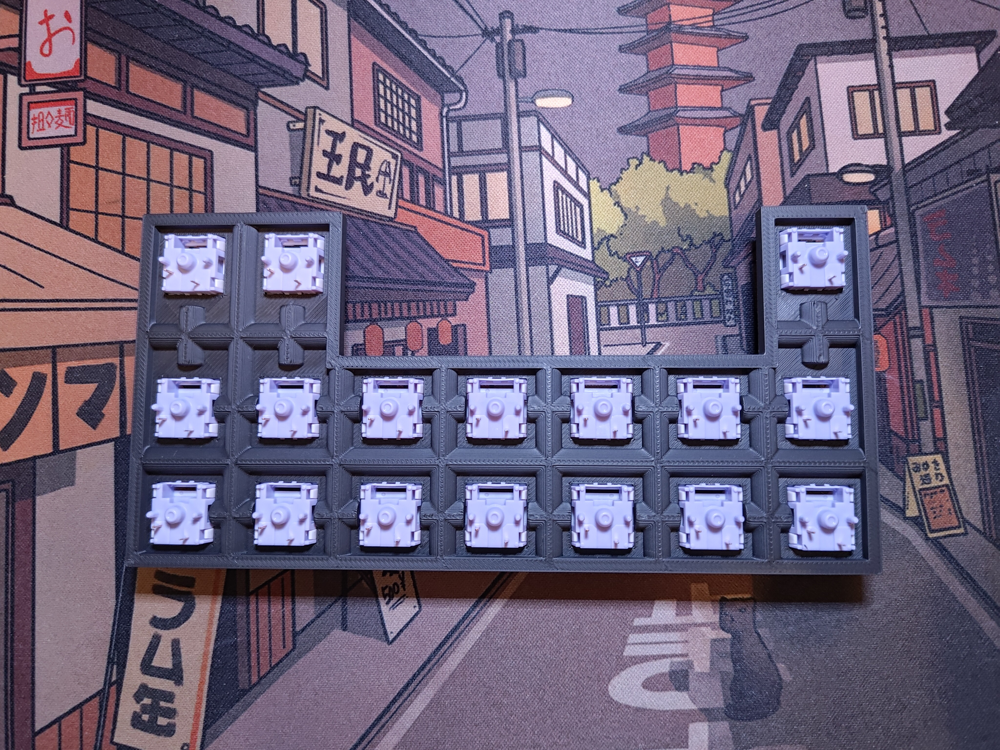
*The **Lower face panel** with the key switches installed.*

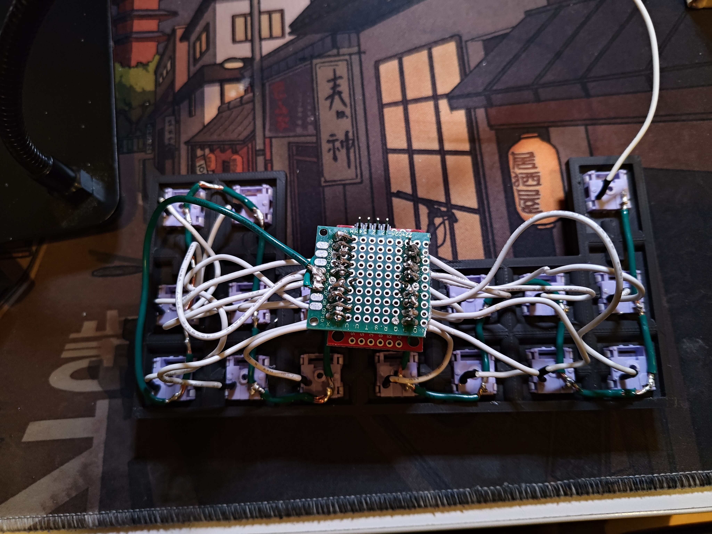
*The wiring for all the key switches (partially complete).*

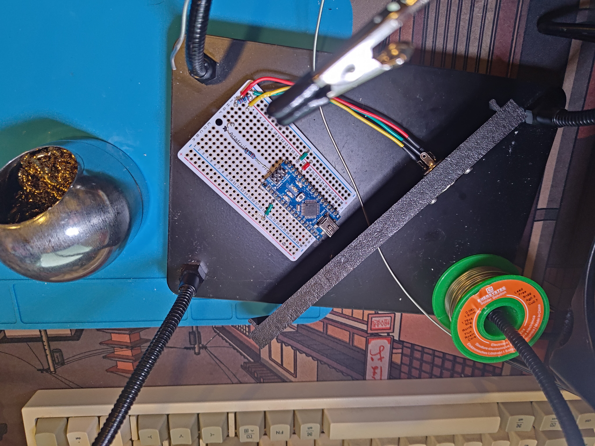
*Testing out MIDI output messages early on in the software development process*

*Please don't refer to this image as an exact reference for how to wire your circuit, this was early in the process and contains mistakes. But, it should give you a general idea of how I had my circuit setup.*

*My original approach to wiring up the WAV trigger, it worked, but I ended up redoing it in favor of jumper wires instead of soldered on wires. I also ended up desoldering the 9V socket so that it could sit flush with my enclosure design*

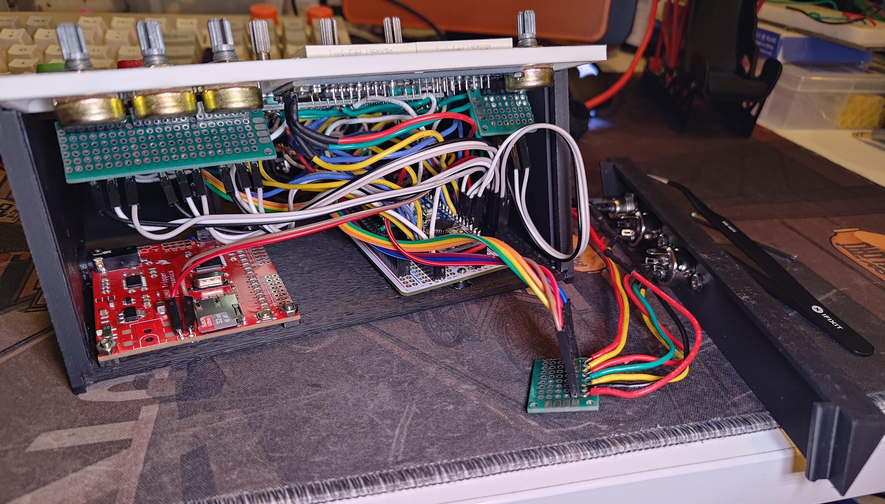
*How everything eventually fit together. I used a lot of jumper wires because I realized that I was overconfident in my get-it-right-on-my-first-try soldering. The green protoboards shown were used in conjunction with jumper wire headers to manage the wires in a DIY ribbon cable-like approach.*

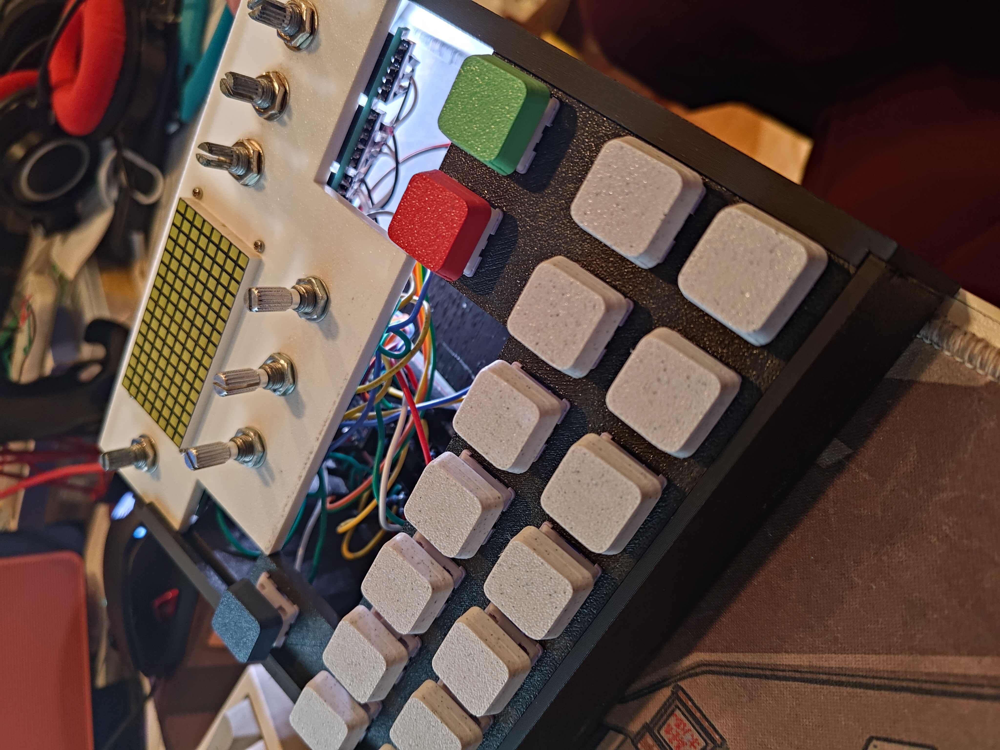
*A mess of internal wires as seen from above.*

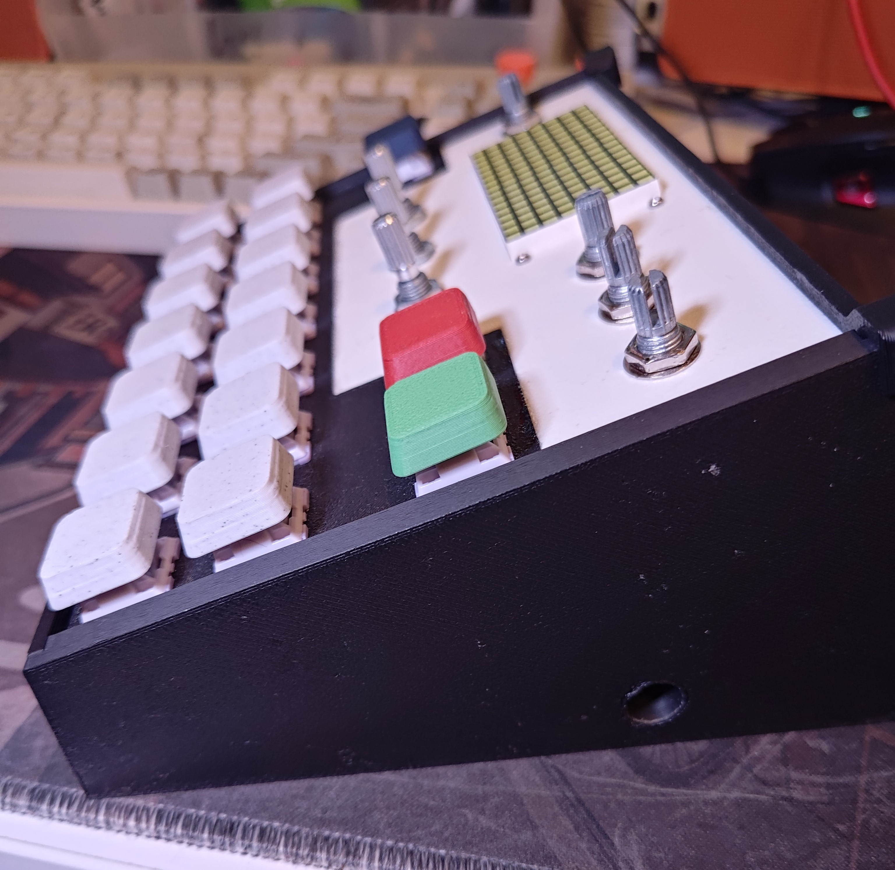
*A shot from the right side of the **ARD**SEQU**INO** to display the 3.5mm audio output.*

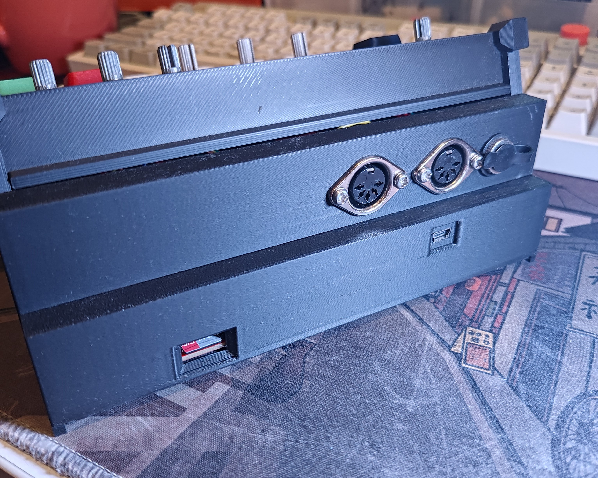
*A shot of the rear I/O panels, in the 3D models and circuit schematics I've shared, the 9V input to the right of the MIDI sockets has been removed. The MIDI sockets are input then output from right to left. Also visible is the Mini USB socket for both power and programming as well as the micro SD card slot for the WAV Trigger.*

## User Manual

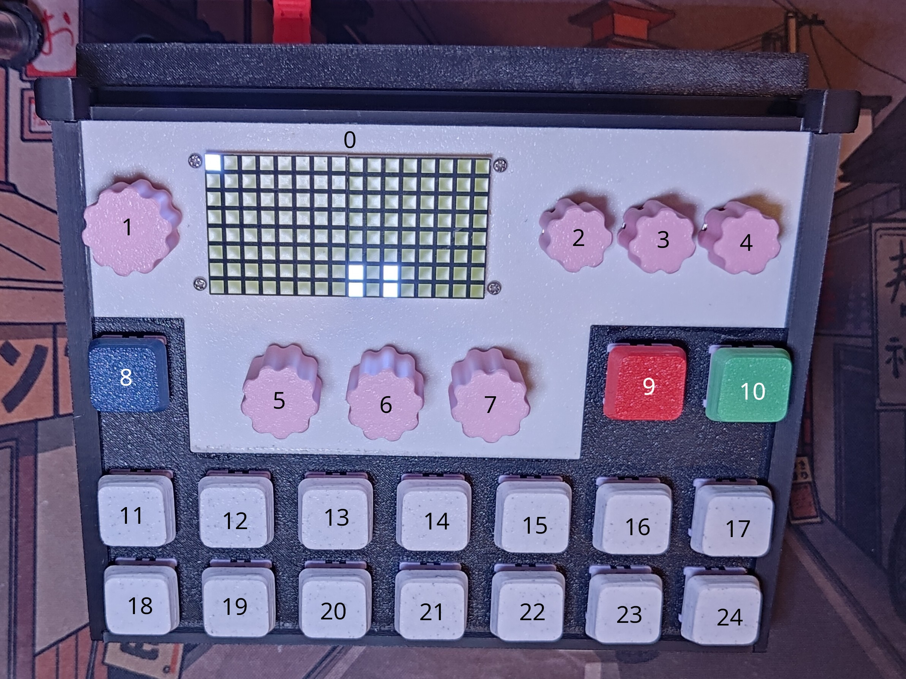

0. The LED panel that displays information for both modes: sequencer and parameter menu.
   - In sequencer mode:
     - the top 6 rows display the user's position within a sequence.
     - The bottom two rows contain the rest of the info regarding the sequencer:
       - LEDs in columns 1-7 light up if a corresponding key is pressed or sequenced.
       - LEDs in columns 9-11 represent whether the sequencer is paused (two lit vertical bars) or playing (no lit pixels).
       - A single LED in column 13 represents whether the sequencer is recording (blinking) or not (no lit pixel).
       - LEDs in column 15-16 represent the page of the sequencer (up to 4 pages).
   - In parameter menu mode:
     - The LED panel will first display which key was the last pressed, any subsequent parameter changes will affect that specific key. Simply press another key to select it and adjust it.
1. The track volume knob. This controls the volume of each key independently and applies to the last pressed key. Internally it adjusts the velocity parameter associated with a given key.
2. Global volume knob, it adjusts the overall volume of the **ARD***SEQU***INO**. Internally it adjusts MIDI CC value 7 on the global MIDI channel.
3. Global attack knob, it adjusts the overall attack of the **ARD***SEQU***INO**. Internally it adjusts MIDI CC value 73 on the global MIDI channel.
4. Global release knob, it adjusts the overall release of the **ARD***SEQU***INO**. Internally it adjusts MIDI CC value 72 on the global MIDI channel.
5. This knob has multiple functions:
   - In sequencer mode:
     - Rotating this knob changes the PC value.
     - Rotating + shift changes the global MIDI channel number.
   - In parameter menu mode:
     - Rotating this knob changes the MIDI note assigned to a selected key.
     - Rotating + shift changes the MIDI channel assigned to a selected key.
     - Pressing this knob will set a selected key's: volume back to max, MIDI channel to the global MIDI channel, probability to 100%, and note-off state to off.
6. This knob has multiple functions:
   - In sequencer mode:
     - Rotating this knob changes the sequencer length.
   - In parameter menu mode:
     - Rotating this knob changes the probability of this key being played if recorded into a sequence.
     - Pressing this knob toggles note-off on/off for a selected key. Note-off is the ability to mute a note as soon as the key is no longer held.
7. This knob has multiple functions:
   - In sequencer mode:
     - Rotating this knob changes the BPM.
     - Rotating + shift changes the notes per beat.
     - Pressing this knob toggles the direction of the sequencer.
8. This key acts as a shift key when held and toggles between the two modes when pressed quickly.
9. This key toggles record on/off for the sequencer and if shift is held, will navigate backwards through the sequencer.
10. This key toggles play/pause for the sequencer and if shift is held, will navigate forward through the sequencer.
11. (through 24) Are the keys in charge of playing MIDI notes. Pressing one of these keys will light up a corresponding LED in sequencer mode. To select a key without sending out an unwanted MIDI note, hold shift.

### GIF Demonstrations

*A demo of the keys being pressed and how a corresponding LED lights up.*

*A demo of the track volume being adjusted.*

*A demo of the global volume being adjusted.*

*A demo of the attack being adjusted.*

*A demo of the release being adjusted.*

*A demo of the PC value being adjusted.*

*A demo of the global MIDI channel being adjusted.*

*A demo of the sequencer length being adjusted.*

*A demo of the BPM being adjusted and reversed.*

*A demo of the notes per beat being adjusted.*

*A demo of the sequencer being played and paused.*

*A demo of the toggling record on and off.*

*A demo of the sequencer recording midi notes while playing.*

*A demo of navigating through sequencer steps.*

*A demo of switching from sequencer mode to parameter menu mode.*

*A demo of the knob functions in parameter menu mode.*

*A demo of resetting the parameters of a key.*

*A demo of toggling note-off on/off.*

### Software Tweaks that might help you

- Are your potentiometers reversed?
  - locate this line of code at the top of `ARDSEQUIN0.h`: `#define FLIPPED_POTS`. Simply comment this line in/out depending on the way your hardware is hooked up. Then recompile!
- Is the LED screen displaying upside down?
  - locate this line of code at the top of `ARDSEQUIN0.h`: `#define FLIPPED_LEDS`. Simply comment this line in/out depending on the way your hardware is hooked up. Then recompile!
- Do the key switch positions not match the position of the corresponding LED pixel being lit up?
  - Navigate to about line `130` in `ARDSEQUINO.ino` where you will see multiple lines defining various `key_array[X].led_pos[X]`. The comment next to each line corresponds with the position of the physical key switch, now remap the index of each `key_array[X]` until everything lines up. This is wholly dependent on how you wired your keys.